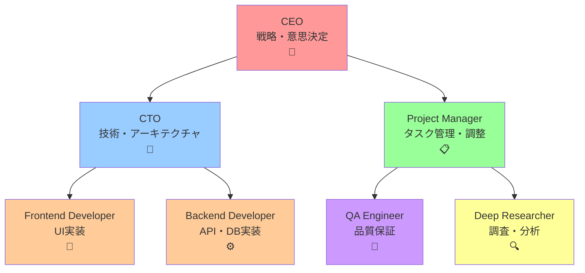

# AI Virtual Corporation

## 🌟 ミッション
AIとの協働により、人類の創造性と生産性を最大化する

## 🏢 組織図

```mermaid
graph TD
    CEO[CEO<br/>戦略・意思決定<br/>🎯]
    CTO[CTO<br/>技術・アーキテクチャ<br/>🔧]
    PM[Project Manager<br/>タスク管理・調整<br/>📋]
    FE[Frontend Developer<br/>UI実装<br/>🎨]
    BE[Backend Developer<br/>API・DB実装<br/>⚙️]
    QA[QA Engineer<br/>品質保証<br/>🧪]
    DR[Deep Researcher<br/>調査・分析<br/>🔍]
    
    CEO --> CTO
    CEO --> PM
    CTO --> FE
    CTO --> BE
    PM --> QA
    PM --> DR
    
    style CEO fill:#ff9999
    style CTO fill:#99ccff
    style PM fill:#99ff99
    style FE fill:#ffcc99
    style BE fill:#ffcc99
    style QA fill:#cc99ff
    style DR fill:#ffff99
```

## 📁 プロジェクト
