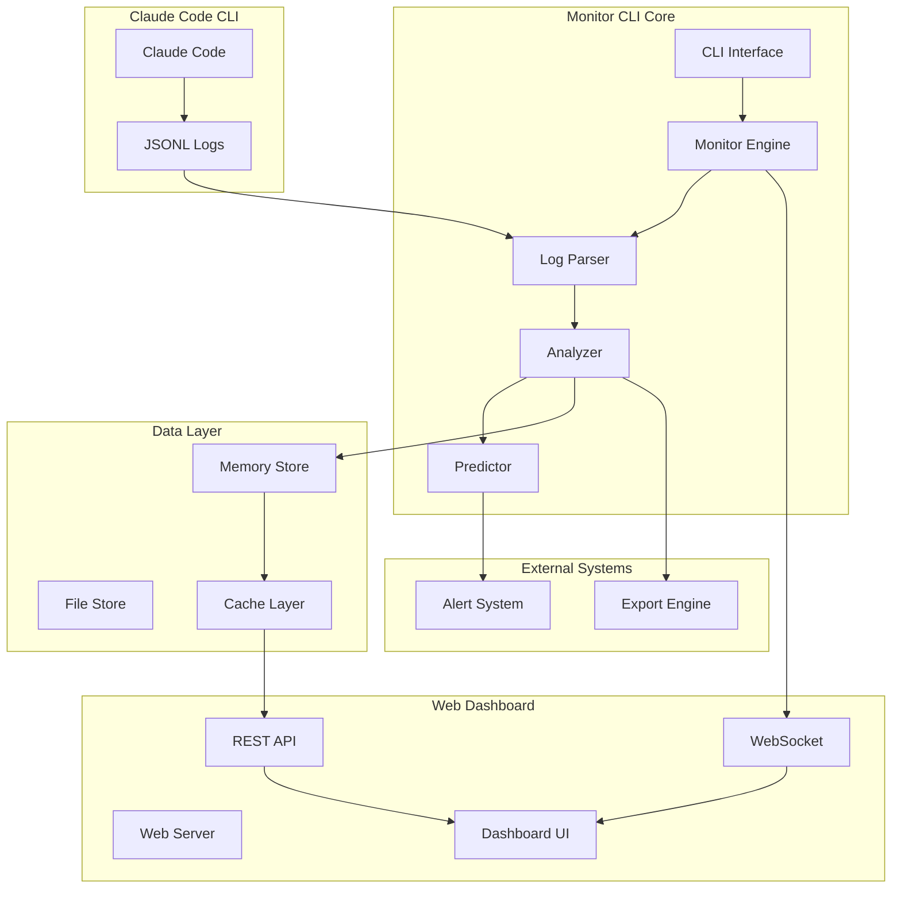

# Claude Agent Monitor CLI - 技術設計書

**プロジェクト名**: Claude Agent Monitor CLI  
**バージョン**: 1.0.0  
**作成日**: 2025-07-29  
**作成者**: AI Virtual Corporation Technical Team  
**承認者**: CTO & CEO  

## 1. システム概要

### 1.1 アーキテクチャ概要

Claude Agent Monitor CLIは、Claude Code CLIのローカルログを解析し、AIエージェント活動を監視・分析するシステムです。モジュラー設計により拡張性と保守性を確保し、リアルタイム監視とWebダッシュボードを提供します。

### 1.2 設計原則

1. **モジュラー設計**: 単一責任原則に基づく疎結合なモジュール構成
2. **リアルタイム性**: イベント駆動による即座な情報更新
3. **データプライバシー**: ローカル処理限定、外部送信なし
4. **拡張性**: プラグインアーキテクチャによる機能拡張
5. **信頼性**: エラーハンドリングと自動復旧機能

## 2. システムアーキテクチャ

### 2.1 全体アーキテクチャ



### 2.2 レイヤード アーキテクチャ

```
┌─────────────────────────────────────────┐
│           Presentation Layer            │
│  CLI Interface  │  Web Dashboard       │
├─────────────────────────────────────────┤
│            Application Layer            │
│  Monitor Engine │  Analyzer │ Predictor│
├─────────────────────────────────────────┤
│            Domain Layer                 │
│  Agent Models   │  Session Models      │
├─────────────────────────────────────────┤
│         Infrastructure Layer            │
│  Log Parser │ Data Store │ Web Server   │
└─────────────────────────────────────────┘
```

## 3. コンポーネント設計

### 3.1 CLI Interface Layer

#### 3.1.1 CLI Commander (`src/cli/commander.js`)
```javascript
class CLICommander {
    // コマンドライン引数の解析とルーティング
    async parseCommand(argv) {}
    async executeCommand(command, options) {}
    
    // 使用可能コマンド
    // monitor start/stop/status
    // dashboard start/stop
    // report generate
    // config set/get
}
```

#### 3.1.2 CLI Output (`src/cli/output.js`)
```javascript
class CLIOutput {
    // コンソール出力の統一管理
    success(message) {}
    error(message) {}
    warning(message) {}
    info(message) {}
    table(data) {}
    progress(current, total) {}
}
```

### 3.2 Monitor Engine Layer

#### 3.2.1 Monitor Engine (`src/monitor/engine.js`)
```javascript
class MonitorEngine {
    constructor(config) {
        this.logParser = new LogParser(config.logPath);
        this.analyzer = new Analyzer();
        this.predictor = new Predictor();
        this.eventEmitter = new EventEmitter();
    }
    
    async start() {
        // 監視開始
        await this.logParser.watch();
        this.setupEventHandlers();
    }
    
    async stop() {
        // 監視停止
        await this.logParser.unwatch();
    }
    
    getStatus() {
        return {
            isRunning: this.isRunning,
            uptime: this.uptime,
            sessionsMonitored: this.sessionsCount,
            lastUpdate: this.lastUpdate
        };
    }
}
```

#### 3.2.2 Log Parser (`src/parser/logParser.js`)
```javascript
class LogParser {
    constructor(logPath = '~/.claude/logs/') {
        this.logPath = logPath;
        this.watchers = new Map();
        this.parsers = new Map();
    }
    
    async watch() {
        // ログディレクトリの監視開始
        const watcher = chokidar.watch(this.logPath);
        watcher.on('add', this.onLogFileAdded.bind(this));
        watcher.on('change', this.onLogFileChanged.bind(this));
    }
    
    async parseLogFile(filePath) {
        // JSONLファイルの解析
        const logs = await this.readJSONL(filePath);
        return logs.map(log => this.transformLog(log));
    }
    
    transformLog(rawLog) {
        return {
            timestamp: rawLog.timestamp,
            sessionId: rawLog.session_id,
            agentType: this.detectAgentType(rawLog),
            tokenUsage: rawLog.token_usage,
            content: rawLog.content,
            metadata: rawLog.metadata
        };
    }
    
    detectAgentType(log) {
        // エージェント識別ロジック
        const patterns = {
            'ceo': /戦略|意思決定|全体最適|データが物語っている/,
            'cto': /技術|アーキテクチャ|セキュリティ|パフォーマンス/,
            'pm': /プロジェクト|タスク|進捗|スケジュール/,
            'frontend': /UI|UX|React|Vue|CSS|HTML/,
            'backend': /API|データベース|サーバー|Node.js/,
            'qa': /テスト|品質|バグ|検証/,
            'researcher': /調査|分析|リサーチ|データ収集/
        };
        
        for (const [agent, pattern] of Object.entries(patterns)) {
            if (pattern.test(log.content)) {
                return agent;
            }
        }
        
        return 'unknown';
    }
}
```

### 3.3 Data Layer

#### 3.3.1 Memory Store (`src/data/memoryStore.js`)
```javascript
class MemoryStore {
    constructor() {
        this.sessions = new Map();
        this.agents = new Map();
        this.metrics = new Map();
        this.events = [];
    }
    
    // セッション管理
    addSession(session) {}
    updateSession(sessionId, data) {}
    getSession(sessionId) {}
    getAllSessions() {}
    
    // エージェント管理
    addAgent(agent) {}
    updateAgent(agentId, data) {}
    getAgent(agentId) {}
    getAllAgents() {}
    
    // メトリクス管理
    addMetric(metric) {}
    getMetrics(filter) {}
    
    // イベント管理
    addEvent(event) {}
    getEvents(filter) {}
}
```

#### 3.3.2 File Store (`src/data/fileStore.js`)
```javascript
class FileStore {
    constructor(basePath = './data') {
        this.basePath = basePath;
        this.ensure(['sessions', 'agents', 'metrics', 'reports']);
    }
    
    // 永続化機能
    async saveSession(session) {}
    async loadSession(sessionId) {}
    async saveReport(report) {}
    async loadReport(reportId) {}
    
    // データエクスポート
    async exportData(format, filter) {}
    async importData(filePath) {}
}
```

### 3.4 Analysis Layer

#### 3.4.1 Analyzer (`src/analysis/analyzer.js`)
```javascript
class Analyzer {
    constructor() {
        this.metrics = new MetricsCalculator();
        this.patterns = new PatternDetector();
    }
    
    // セッション分析
    analyzeSession(session) {
        return {
            duration: this.calculateDuration(session),
            tokenUsage: this.calculateTokenUsage(session),
            efficiency: this.calculateEfficiency(session),
            agentActivity: this.analyzeAgentActivity(session)
        };
    }
    
    // エージェント分析
    analyzeAgent(agentId, timeRange) {
        const sessions = this.getAgentSessions(agentId, timeRange);
        return {
            totalSessions: sessions.length,
            averageDuration: this.calculateAverageDuration(sessions),
            totalTokens: this.calculateTotalTokens(sessions),
            productivity: this.calculateProductivity(sessions),
            patterns: this.detectPatterns(sessions)
        };
    }
    
    // トレンド分析
    analyzeTrends(timeRange) {
        return {
            usageTrend: this.calculateUsageTrend(timeRange),
            agentTrend: this.calculateAgentTrend(timeRange),
            costTrend: this.calculateCostTrend(timeRange)
        };
    }
}
```

#### 3.4.2 Predictor (`src/analysis/predictor.js`)
```javascript
class Predictor {
    constructor() {
        this.models = new Map();
        this.trainedModels = new Map();
    }
    
    // 使用量予測
    predictUsage(currentSession, historicalData) {
        const model = this.getOrCreateModel('usage');
        const features = this.extractFeatures(currentSession, historicalData);
        return model.predict(features);
    }
    
    // セッション終了時間予測
    predictSessionEnd(sessionId) {
        const session = this.getSession(sessionId);
        const burnRate = this.calculateBurnRate(session);
        const remainingTokens = this.calculateRemainingTokens(session);
        
        return {
            estimatedEndTime: this.calculateEndTime(burnRate, remainingTokens),
            confidence: this.calculateConfidence(session),
            recommendation: this.generateRecommendation(session)
        };
    }
    
    // 異常検知
    detectAnomalies(currentMetrics, historicalMetrics) {
        const anomalies = [];
        
        if (this.isUsageAnomaly(currentMetrics, historicalMetrics)) {
            anomalies.push({
                type: 'usage_spike',
                severity: 'high',
                message: 'Token usage significantly higher than normal'
            });
        }
        
        return anomalies;
    }
}
```

### 3.5 Web Dashboard Layer

#### 3.5.1 Web Server (`src/web/server.js`)
```javascript
class WebServer {
    constructor(port = 3333) {
        this.app = express();
        this.server = null;
        this.socketIO = null;
        this.port = port;
    }
    
    async start() {
        this.setupMiddleware();
        this.setupRoutes();
        this.setupSocketIO();
        
        this.server = this.app.listen(this.port, () => {
            console.log(`Dashboard available at http://localhost:${this.port}`);
        });
    }
    
    setupRoutes() {
        // REST API routes
        this.app.get('/api/sessions', this.getSessions.bind(this));
        this.app.get('/api/agents', this.getAgents.bind(this));
        this.app.get('/api/metrics', this.getMetrics.bind(this));
        this.app.get('/api/predictions', this.getPredictions.bind(this));
        
        // Static files
        this.app.use(express.static('src/web/public'));
        this.app.get('/', (req, res) => {
            res.sendFile('index.html', { root: 'src/web/public' });
        });
    }
    
    setupSocketIO() {
        this.socketIO = new SocketIOServer(this.server);
        
        this.socketIO.on('connection', (socket) => {
            console.log('Client connected');
            
            // リアルタイム更新の送信
            this.monitorEngine.on('sessionUpdate', (data) => {
                socket.emit('sessionUpdate', data);
            });
            
            this.monitorEngine.on('alert', (alert) => {
                socket.emit('alert', alert);
            });
        });
    }
}
```

#### 3.5.2 Dashboard UI (`src/web/public/js/dashboard.js`)
```javascript
class Dashboard {
    constructor() {
        this.socket = io();
        this.charts = new Map();
        this.setupEventListeners();
        this.initializeCharts();
    }
    
    setupEventListeners() {
        this.socket.on('sessionUpdate', this.updateSessionData.bind(this));
        this.socket.on('alert', this.showAlert.bind(this));
    }
    
    initializeCharts() {
        // Token Usage Chart
        this.charts.set('tokenUsage', new Chart('tokenUsageChart', {
            type: 'line',
            data: { labels: [], datasets: [] },
            options: { responsive: true }
        }));
        
        // Agent Activity Chart
        this.charts.set('agentActivity', new Chart('agentActivityChart', {
            type: 'doughnut',
            data: { labels: [], datasets: [] },
            options: { responsive: true }
        }));
        
        // Session Timeline Chart
        this.charts.set('timeline', new Chart('timelineChart', {
            type: 'bar',
            data: { labels: [], datasets: [] },
            options: { responsive: true }
        }));
    }
    
    async loadData() {
        try {
            const [sessions, agents, metrics] = await Promise.all([
                fetch('/api/sessions').then(r => r.json()),
                fetch('/api/agents').then(r => r.json()),
                fetch('/api/metrics').then(r => r.json())
            ]);
            
            this.updateCharts(sessions, agents, metrics);
            this.updateSummary(sessions, agents, metrics);
        } catch (error) {
            console.error('Failed to load data:', error);
        }
    }
}
```

## 4. データモデル設計

### 4.1 Session Model
```javascript
const SessionSchema = {
    id: String,          // セッション一意ID
    startTime: Date,     // セッション開始時間
    endTime: Date,       // セッション終了時間（null if active）
    agentType: String,   // エージェント種別
    agentId: String,     // エージェント一意ID
    tokenUsage: {
        input: Number,   // 入力トークン数
        output: Number,  // 出力トークン数
        total: Number    // 合計トークン数
    },
    status: String,      // 'active', 'completed', 'error'
    metadata: {
        claudeVersion: String,
        model: String,
        temperature: Number,
        maxTokens: Number
    },
    events: [{
        timestamp: Date,
        type: String,
        data: Object
    }],
    files: [{             // 生成・編集されたファイル
        path: String,
        action: String,   // 'create', 'update', 'delete'
        size: Number,
        timestamp: Date
    }]
};
```

### 4.2 Agent Model
```javascript
const AgentSchema = {
    id: String,           // エージェント一意ID
    type: String,         // 'ceo', 'cto', 'pm', etc.
    name: String,         // エージェント名
    description: String,  // エージェント説明
    createdAt: Date,      // 作成日時
    lastActive: Date,     // 最後のアクティビティ
    stats: {
        totalSessions: Number,
        totalTokens: Number,
        totalFiles: Number,
        averageSessionTime: Number,
        productivityScore: Number
    },
    preferences: {
        alertThreshold: Number,
        reportFrequency: String
    }
};
```

### 4.3 Metrics Model
```javascript
const MetricsSchema = {
    timestamp: Date,
    period: String,       // 'minute', 'hour', 'day'
    agentId: String,
    sessionId: String,
    metrics: {
        tokenRate: Number,      // tokens per minute
        responseTime: Number,   // average response time
        errorRate: Number,      // error percentage
        efficiency: Number,     // productivity score
        cost: Number           // estimated cost
    },
    predictions: {
        nextHourUsage: Number,
        sessionEndTime: Date,
        burnRate: Number,
        remainingTokens: Number
    }
};
```

## 5. API設計

### 5.1 REST API Endpoints

```yaml
# Sessions API
GET    /api/sessions              # セッション一覧取得
GET    /api/sessions/:id          # 特定セッション取得
POST   /api/sessions              # セッション作成
PUT    /api/sessions/:id          # セッション更新
DELETE /api/sessions/:id          # セッション削除

# Agents API  
GET    /api/agents                # エージェント一覧取得
GET    /api/agents/:id            # 特定エージェント取得
GET    /api/agents/:id/sessions   # エージェントのセッション一覧
GET    /api/agents/:id/metrics    # エージェントのメトリクス

# Metrics API
GET    /api/metrics               # メトリクス取得
GET    /api/metrics/summary       # サマリーメトリクス
GET    /api/metrics/trends        # トレンドデータ

# Predictions API
GET    /api/predictions           # 予測データ取得
GET    /api/predictions/usage     # 使用量予測
GET    /api/predictions/alerts    # アラート予測

# Reports API
GET    /api/reports               # レポート一覧
POST   /api/reports               # レポート生成
GET    /api/reports/:id           # 特定レポート取得
GET    /api/reports/:id/download  # レポートダウンロード

# Configuration API
GET    /api/config                # 設定取得
PUT    /api/config                # 設定更新
```

### 5.2 WebSocket Events

```javascript
// クライアント → サーバー
{
    'subscribe': { channels: ['sessions', 'agents', 'alerts'] },
    'unsubscribe': { channels: ['sessions'] },
    'request_data': { type: 'sessions', filter: {} }
}

// サーバー → クライアント
{
    'sessionUpdate': { sessionId, data },
    'agentUpdate': { agentId, data },
    'newSession': { session },
    'sessionEnd': { sessionId, summary },
    'alert': { type, severity, message, data },
    'prediction': { type, prediction, confidence }
}
```

## 6. セキュリティ設計

### 6.1 データセキュリティ
- **ローカル処理限定**: 全データ処理をローカルマシンで実行
- **データ暗号化**: 保存データの AES-256 暗号化
- **アクセス制御**: ファイル権限による制限
- **ログ保護**: 機密情報の自動マスキング

### 6.2 通信セキュリティ
- **HTTPS使用**: ダッシュボード通信の暗号化
- **CORS制御**: 適切なCORS設定
- **認証機能**: Basic認証（オプション）
- **セッション管理**: セキュアなセッション管理

### 6.3 プライバシー保護
- **データ匿名化**: 個人識別情報の除去
- **保持期間制限**: 古いデータの自動削除
- **オプトアウト**: データ収集の無効化機能
- **透明性**: データ処理の完全な可視化

## 7. パフォーマンス設計

### 7.1 パフォーマンス要件
- **レスポンス時間**: API応答 < 100ms
- **スループット**: 100req/s対応
- **メモリ使用量**: < 256MB
- **CPU使用率**: < 10%（アイドル時）

### 7.2 最適化戦略
- **非同期処理**: Node.js非同期パターンの活用
- **キャッシュ機能**: 頻繁アクセスデータのキャッシュ
- **データ圧縮**: ログデータの効率的圧縮
- **リソース管理**: メモリリーク防止、リソース自動解放

### 7.3 スケーラビリティ
- **水平スケーリング**: マルチプロセス対応
- **データ分散**: 時系列データの効率的分散
- **負荷分散**: 処理負荷の動的分散
- **キューイング**: 高負荷時のキューイング機能

## 8. エラーハンドリング設計

### 8.1 エラー分類
```javascript
const ErrorTypes = {
    SYSTEM_ERROR: 'system_error',           // システムエラー
    VALIDATION_ERROR: 'validation_error',   // バリデーションエラー
    PERMISSION_ERROR: 'permission_error',   // 権限エラー
    NETWORK_ERROR: 'network_error',         // ネットワークエラー
    DATA_ERROR: 'data_error'                // データエラー
};
```

### 8.2 エラーハンドリング戦略
- **Graceful Degradation**: 部分的機能停止時の代替機能提供
- **自動復旧**: 一時的エラーからの自動回復
- **エラーログ**: 詳細なエラー情報の記録
- **ユーザー通知**: 分かりやすいエラーメッセージ

### 8.3 監視・アラート
- **ヘルスチェック**: システム状態の定期的確認
- **閾値監視**: メトリクス異常の自動検知
- **アラート通知**: 重要なエラーの即座通知
- **復旧支援**: エラー状況からの復旧ガイド

## 9. テスト戦略

### 9.1 テストピラミッド
```
    E2E Tests (10%)
   ├─────────────────┤
  Integration Tests (20%)
 ├─────────────────────────┤
Unit Tests (70%)
├───────────────────────────────┤
```

### 9.2 テスト種別
- **Unit Tests**: 各モジュールの単体テスト
- **Integration Tests**: コンポーネント間連携テスト
- **E2E Tests**: エンドツーエンドテスト
- **Performance Tests**: パフォーマンステスト
- **Security Tests**: セキュリティテスト

### 9.3 テストツール
- **Jest**: Unit/Integration テストフレームワーク
- **Playwright**: E2Eテストツール
- **Artillery**: 負荷テストツール
- **ESLint**: 静的解析ツール
- **SonarQube**: コード品質分析

## 10. デプロイメント設計

### 10.1 パッケージング
```json
{
  "name": "claude-agent-monitor",
  "version": "1.0.0",
  "bin": {
    "claude-monitor": "./bin/claude-monitor.js"
  },
  "files": [
    "src/",
    "bin/",
    "public/",
    "README.md"
  ]
}
```

### 10.2 インストール方法
```bash
# NPM global install
npm install -g claude-agent-monitor

# Standalone binary
curl -o claude-monitor https://releases.com/claude-monitor
chmod +x claude-monitor
```

### 10.3 環境設定
```javascript
// Configuration file: ~/.claude-monitor/config.json
{
  "logPath": "~/.claude/logs/",
  "dataPath": "~/.claude-monitor/data/",
  "dashboardPort": 3333,
  "alertThreshold": 0.8,
  "retentionDays": 30,
  "agents": {
    "enabled": ["ceo", "cto", "pm", "frontend", "backend", "qa", "researcher"],
    "customPatterns": {}
  }
}
```

## 11. 次段階計画

### 11.1 Phase 2 機能
- **機械学習**: 高度な予測分析モデル
- **プラグイン**: サードパーティ拡張機能
- **クラウド**: オプショナルクラウド連携
- **チーム**: マルチユーザー対応

### 11.2 技術負債対策
- **リファクタリング**: コード品質の継続的改善
- **依存関係**: ライブラリ更新とセキュリティ対策
- **ドキュメント**: 技術文書の定期的更新
- **パフォーマンス**: 継続的な最適化

---

**レビュー状況**: 技術設計完了  
**次段階**: 詳細設計書作成  
**承認予定**: 2025-07-30  
**実装開始**: 技術設計承認後